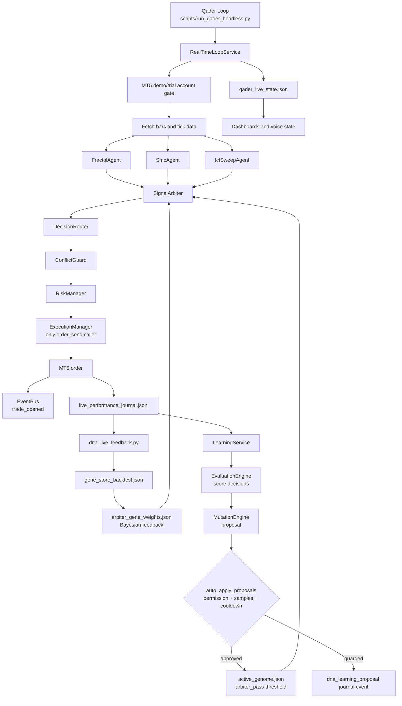

# Qader Agent Flow Diagram

This diagram shows the live Qader/FRIDAY agent path as implemented in the
REAL_CONTROLLED_MODE loop. Learning changes Strategy DNA only; Python source
modification stays disabled.

## Runtime Notes

- `RealTimeLoopService` records every cycle into `logs/qader_realtime_loop.jsonl`.
- Trade entries call the learning path through `_record_trade_learning()`.
- `LearningService` proposes threshold changes from recent scored decisions.
- `MutationEngine` applies proposals to `data/qader/dna/active_genome.json` only when `can_modify_strategy_dna` is granted.
- `SignalArbiter` reads `active_genome.json` as its base threshold and lets matching Bayesian gene weights override it for a specific market context.
- Dashboard state includes `learning_state` from the latest proposal/application attempt.
